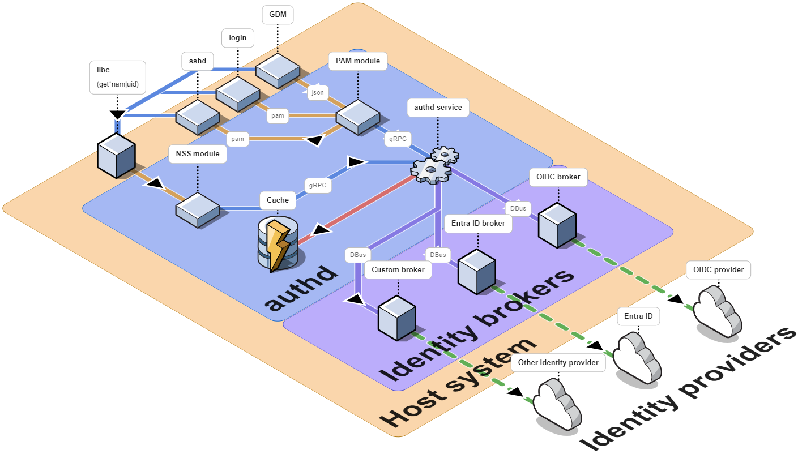

# authd architecture

authd can help organisations ensure secure identity and access management by enabling seamless cloud-based authentication of Ubuntu machines.
Here we explain the architecture of authd and some of its design decisions.
Links are provided at the end to support further reading.

## Architecture components

authd acts as an interface between the host system and external identity providers. 
Remote information is cached when authenticating with authd, which improves performance while also facilitating offline access.

The diagram below illustrates the components of authd and their communication methods:



The architecture of authd consists of the following components:

* The **authentication daemon** (authd): a daemon that runs on the host and manages access to the authentication service.
* An **identity broker**: a trusted component running on the host and serving as an interface with the identity provider.
* The **identity provider**: the remote service that manages digital identities, such as Microsoft Entra ID.
* A **PAM module**: the library that handles the authentication tasks of applications on the system. The authentication tasks that are currently handled by PAM include GDM, login, ssh and sudo. Support for webview is being developed. 
* An **NSS module**: a module that queries authd to retrieve user information from the cache.

```{note}
One or multiple identity brokers and identity providers can be enabled at the same time.
```

## Capabilities negotiation

The platform (whether Ubuntu Desktop, Ubuntu Server, or Ubuntu cloud instance) describes its capabilities and current state, including the availability of a graphical interface, online status, and other general features such as TPM, smartcard, or biometric support.

The broker, acting as the decision-maker, evaluates its capabilities and current state to select the appropriate workflow. It can also consider specific decision factors, such as temporarily bypassing full MFA or permitting offline cached authentication for a specified duration.

The broker is a trusted component within the system and serves as the interface with the identity provider.

## Inter-process communication

Internal components of authd, such as PAM and NSS modules, communicate over gRPC. The advantage of gRPC is that it delivers high performance and native streaming, with built-in security for efficient and secure communication in distributed systems.

The communication between authd and the brokers is done over DBus. DBus supports message broadcasting and enables efficient resource sharing. The communication only goes from the authentication daemon to the broker, which responds to requests. The transactions are encrypted, ensuring that communications between the broker and authd are secure.

## Links

* [Microsoft Entra fundamentals documentation](https://learn.microsoft.com/en-us/entra/fundamentals/)  
* [OpenID Connect (OIDC) on the Microsoft identity platform](https://learn.microsoft.com/en-us/entra/identity-platform/v2-protocols-oidc)   
* [What is OpenID Connect and what do you use it for? \- Auth0](https://auth0.com/intro-to-iam/what-is-openid-connect-oidc)  
* [What Is OpenID Connect (OIDC)? | Microsoft Security](https://www.microsoft.com/en-us/security/business/security-101/what-is-openid-connect-oidc) 
