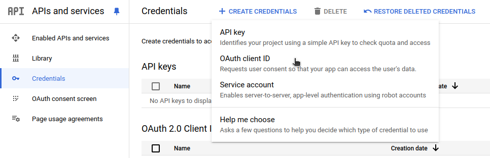
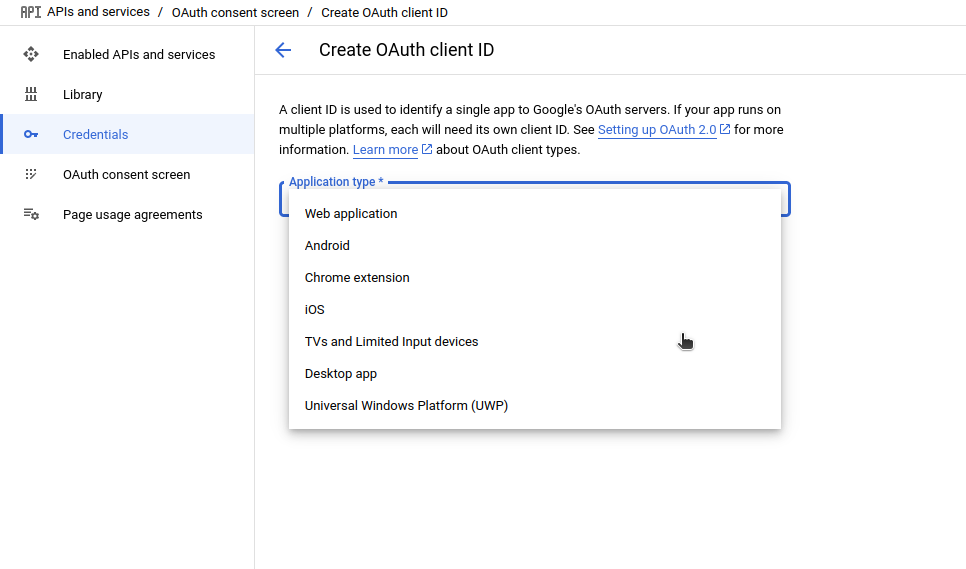
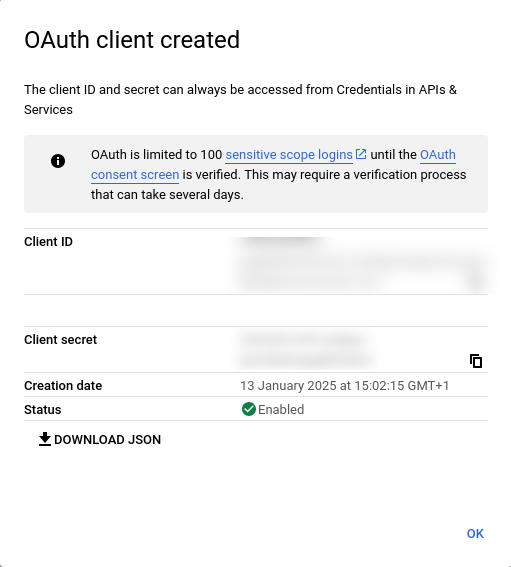
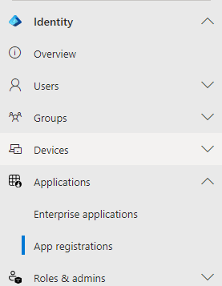
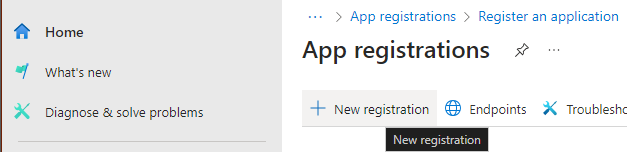
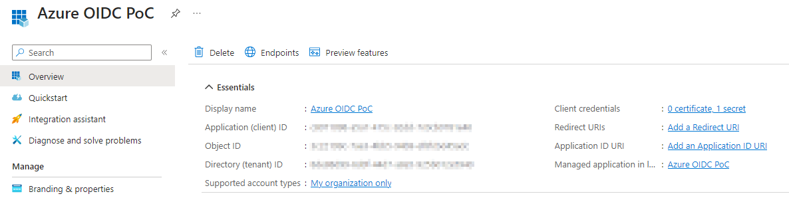
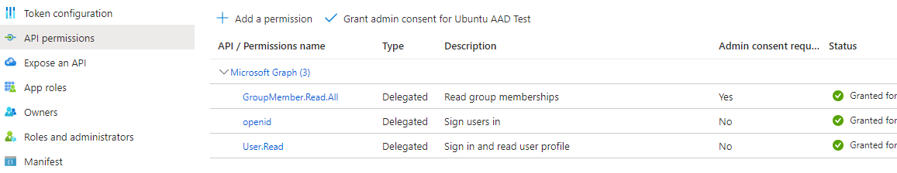

---
myst:
  html_meta:
    "description lang=en": "Configure authd and its identity brokers to enable authentication of Ubuntu devices with multiple cloud identity providers, including Google IAM and Microsoft Entra ID."
---

# Configure authd for cloud identity providers

This guide shows how to configure identity brokers to support authentication of
Ubuntu devices with authd and your chosen cloud provider.

## Broker discovery

Create the directory that will contain the declaration files of the broker(s):

```shell
sudo mkdir -p /etc/authd/brokers.d/
```

Then copy the the `.conf` file from your chosen broker snap package:

:::::{tab-set}
:sync-group: broker

::::{tab-item} Google IAM
:sync: google

```shell
sudo cp /snap/authd-google/current/conf/authd/google.conf /etc/authd/brokers.d/
```

::::

::::{tab-item} Microsoft Entra ID
:sync: msentraid

```shell
sudo cp /snap/authd-msentraid/current/conf/authd/msentraid.conf /etc/authd/brokers.d/
```

::::
:::::

This file is used to declare the brokers available on the system. 

```{note}
Several brokers can be enabled at the same time.
```

## Application registration

This section demonstrates registering an OAuth 2.0 application that your chosen
broker can then use to authenticate users.

:::::{tab-set}
:sync-group: broker

::::{tab-item} Google IAM
:sync: google

### Google IAM

Register a new application in Google IAM. Once the application is registered, note the `Client ID` and the `Client secret`. These values are respectively the `<CLIENT_ID>` and `<CLIENT_SECRET>` that will be used in the next section.

To register a new application go to the [Credentials page](https://console.cloud.google.com/apis/credentials).

Click `Create credentials > OAuth client ID`.



Select the `TVs and Limited Input devices` application type.



Name your OAuth 2.0 client and click `Create`.

Your app's `Client ID` and `Client Secret` will be shown on your page, store them somewhere as you will need them in the next step.



For more detailed information please refer to the [OAuth 2.0 for TV and Limited-Input Device Applications documentation](https://developers.google.com/identity/protocols/oauth2/limited-input-device).


::::

::::{tab-item} Microsoft Entra ID
:sync: msentraid

Register a new application in the Microsoft Azure portal. Once the application is registered, note the `Application (client) ID` and the `Directory (tenant) ID` from the `Overview` menu. These IDs are respectively a `<CLIENT_ID>` and `<ISSUER_ID>` that will be used in the next section.

To register a new application, in Entra, select the menu `Identity > Applications > App registration`



Then `New registration`



And configure it as follows:



Under `Manage`, in the `API permissions` menu, set the following Microsoft Graph permissions:



Ensure the API permission type is set to **Delegated** for each permission.

Finally, as the supported authentication mechanism is the device workflow, you need to allow the public client workflows. Under `Manage`, in the `Authentication` menu, under `Advanced settings`, ensure that `Allow public client flows` is set to **Yes**.

[The Microsoft documentation](https://learn.microsoft.com/en-us/entra/identity-platform/quickstart-register-app) provides detailed instructions for registering an application with the Microsoft identity platform.

::::
:::::


## Broker configuration

Now we can configure the broker. Note that different brokers can require different configuration data.

:::::{tab-set}
:sync-group: broker

::::{tab-item} Google IAM
:sync: google

To configure Google IAM, edit  `/var/snap/authd-google/current/broker.conf`:

```ini
[oidc]
issuer = https://accounts.google.com
client_id = <CLIENT_ID>
client_secret = <CLIENT_SECRET>
```

::::

::::{tab-item} Microsoft Entra ID
:sync: msentraid

To configure Entra ID, edit  `/var/snap/authd-msentraid/current/broker.conf`:

```ini
[oidc]
issuer = https://login.microsoftonline.com/<ISSUER_ID>/v2.0
client_id = <CLIENT_ID>
```

::::
:::::

## Configure allowed users

The users who are allowed to log in (after successfully authenticating via the
identity provider) are configured in the `users` section of the
`/var/snap/authd-<broker_name>/current/broker.conf` file:

```ini
[users]
## 'allowed_users' specifies the users who are permitted to log in after
## successfully authenticating with the Identity Provider.
## Values are separated by commas. Supported values:
## - 'OWNER': Grants access to the user specified in the 'owner' option
##            (see below). This is the default.
## - 'ALL': Grants access to all users who successfully authenticate
##          with the Identity Provider.
## - <username>: Grants access to specific additional users
##               (e.g. user1@example.com).
## Example: allowed_users = OWNER,user1@example.com,admin@example.com
#allowed_users = OWNER

## 'owner' specifies the user assigned the owner role. This user is
## permitted to log in if 'OWNER' is included in the 'allowed_users'
## option.
##
## If this option is left unset, the first user to successfully log in
## via this broker will automatically be assigned the owner role. A
## drop-in configuration file will be created in broker.conf.d/ to set
## the 'owner' option.
##
## To disable automatic assignment, you can either:
## 1. Explicitly set this option to an empty value (e.g. owner = "")
## 2. Remove 'OWNER' from the 'allowed_users' option
##
## Example: owner = user2@example.com
#owner =
```

By default, the first person to log in to the machine is automatically registered
as the owner. If you wish to override this behavior then specify a list of allowed
users with the `allowed_users` option, while omitting the `OWNER` keyword:

```text
allowed_users = person1@email.com,person2@email.com
```

Alternatively, you can directly register someone as the owner by using the `owner`
option:

```text
owner = your@email.com
```

Explicitly setting an empty owner, has the same effect as omitting the `OWNER` keyword
in `allowed_users`:

```text
owner = ""
```

::::
:::::

## Restart the broker

When a configuration file is added you have to restart authd:

```shell
sudo systemctl restart authd
```

When the configuration of a broker is updated, you also have to restart the broker:

:::::{tab-set}
:sync-group: broker

::::{tab-item} Google IAM
:sync: google

```shell
sudo snap restart authd-google
```

::::

::::{tab-item} Microsoft Entra ID
:sync: msentraid

```shell
sudo snap restart authd-msentraid
```

::::
:::::

## System configuration

By default on Ubuntu, the login timeout is 60s. This may be too brief for a device code flow authentication. It can be set to a different value by changing the value of `LOGIN_TIMEOUT` in `/etc/login.defs`
