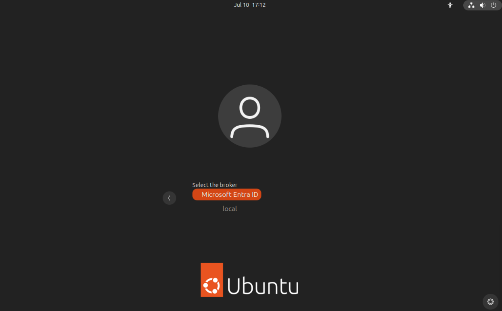
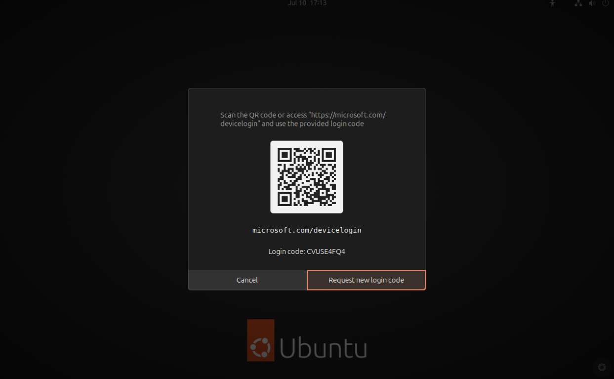
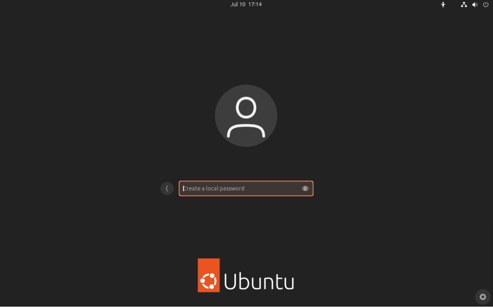

# Log in with GDM

## Logging in with a remote provider

Once the system is configured you can log into your system using your remote provider credentials and the device code flow.
In this example, we are going to use MS Entra ID as the remote provider but the process is equivalent for other providers.

> See all the available providers: [Install brokers](./install-authd.md#install-brokers)

In the login screen (greeter), select `not listed` below the user name field.

Type your remote provider user name. The format is `user@domain.name`

Select the broker `Microsoft Entra ID`



If MFA is enabled, a QR code and a login code are displayed.



From a second device, flash the QR code or type the URL in a web browser, then follow your provider's authentication process.

Upon successful authentication, the user is prompted to enter a local password. This password can be used for offline authentication.



## Commands

### authd

`authd` is socket-activated. It means that the service starts on-demand when it receives a request on a socket.

If you want to restart the service, you can stop it with `sudo systemctl stop authd` and it will restart automatically on the next message it receives.

Run `/usr/libexec/authd --help` to display the entire help.

## Broker management

The broker is managed through the `snap` command.

The main operation is to restart the broker to reload the configuration when it has changed. You can reload the broker with the command:

```shell
sudo snap restart authd-msentraid
```

> If you are using a different broker to `msentraid`, make sure to change the snap name when running this command.
