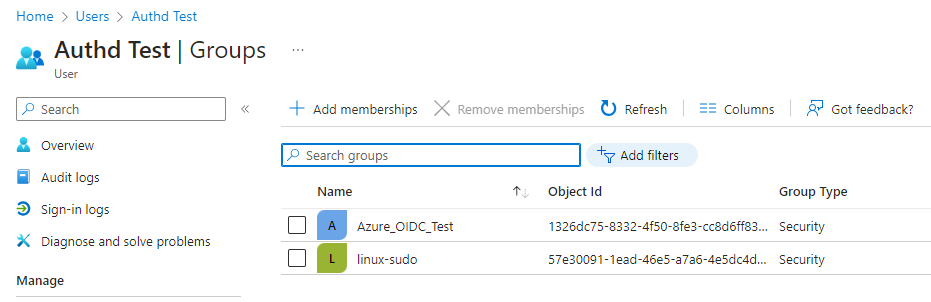

# Log in with GDM

## Logging in with a remote provider

Once the system is configured you can log into your system using your MS Entra ID credentials and the device code flow.

In the login screen (greeter), select ```not listed``` below the user name field.

Type your MS Entra ID user name. The format is ```user@domain.name```

Select the broker `Microsoft Entra ID`


If MFA is enabled, a QR code and a login code are displayed.


From a second device, flash the QR code or type the URL in a web browser, then follow your provider's authentication process.

Upon successful authentication, the user is prompted to enter a local password. This password can be used for offline authentication.


## Group management

In our example the user `authd test` is a member of the Azure groups `Azure_OIDC_Test` and `linux-sudo`:



This translates to the following unix groups on the local machine:

```shell
~$ groups
aadtest-testauthd@uaadtest.onmicrosoft.com sudo azure_oidc_test
```

There are three types of groups:
1. **Primary group**: Created automatically based on the user name
1. **Local group**: Group local to the machine prefixed with `linux-`. For instance if the user is a member of the Azure group `linux-sudo`, they will be a member of the `sudo` group locally.
1. **Remote group**: All the other Azure groups the user is a member of.

## Commands

### authd

```authd``` is socket-activated. It means that the service starts on-demand when it receives a request on a socket.

If you want to restart the service, you can stop it with ```systemctl stop authd``` and it will restart automatically on the next message it receives.

Run ```/usr/libexec/authd --help``` to display the entire help.

## Entra ID broker

The broker is managed through the ```snap``` command. 

The main operation is to restart the broker to reload the configuration when it has changed. You can reload the broker with the command:

```shell
snap restart authd-msentraid
```
