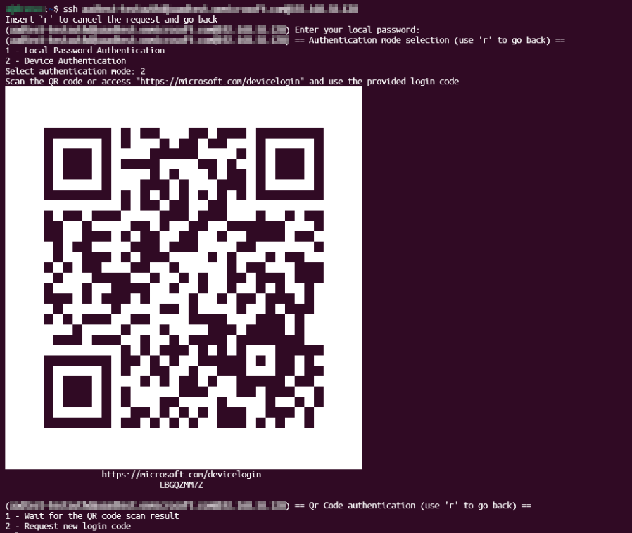

# Log in with SSH

## Server configuration

To enable SSH access with `authd` you must configure `sshd` and the broker.

### SSH configuration

To configure SSH, create a file `/etc/ssh/sshd_config.d/authd.conf` with the following content:

```
UsePAM yes
KbdInteractiveAuthentication yes
```

Alternatively, you can directly set the keys in the sshd configuration file `/etc/ssh/sshd_config`.

Then restart the SSH server:

```shell
sudo systemctl restart ssh
```

### Broker configuration

To configure the broker edit the file `/var/snap/authd-<broker_name>/current/broker.conf` and set the key `ssh_allowed_suffixes` with the list of domains that you want to allow.

```ini
...

[users]
# The username suffixes that are allowed to log in via ssh without existing previously in the system.
# The suffixes must be separated by commas.
ssh_allowed_suffixes = <ALLOWED DOMAINS>
```

You can set several domains separated by a comma. For instance:

```ini
ssh_allowed_suffixes = @example.com,@ubuntu.com
```

## Usage

Once this is all set up, you can ssh to the server in the same way that you would do with any server: `ssh <username>@<host>`. The format of `<username>` is the user handle on the provider, such as `user@domain.tld`.

For instance, here is an example using MS Entra ID as a provider:

```shell
ssh user@domain.tld@remote.host
```


